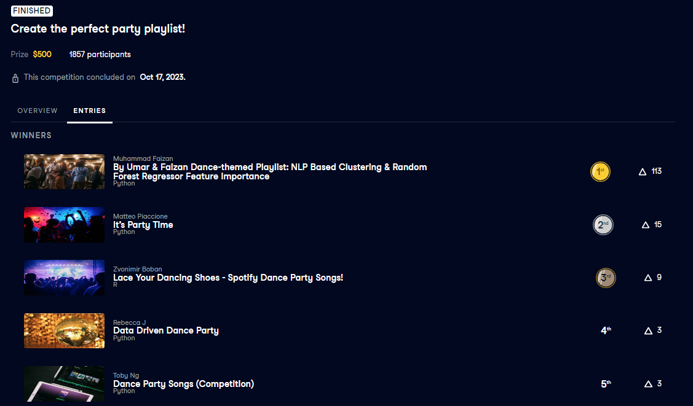

# DataCamp 2023 Competition: Create the Perfect Party Playlist! 🎶

## About

This repository contains the collaborative work of Muhammad Umar Anzar and Faizan during the DataCamp 2023 competition, "Create the Perfect Party Playlist." 🕺🎉

## Achievements

We are thrilled to announce that our dedication and analytical skills led us to secure the **1st place** in this exciting competition! 🥇

## Competition Details

Visit [DataCamp's Competition Page](https://app.datacamp.com/learn/competitions/dance-party-songs?activeTab=competition-entries) to learn more about the competition.

**Datacamp Workspace:** [By Umar & Faizan Dance-themed Playlist](https://app.datacamp.com/workspace/w/83209d5b-2341-46d3-88c3-113ebb8d587b)

For more details on our winning approach and code, please explore the contents of this repository.

This GitHub repository includes an extended version of our competition work.